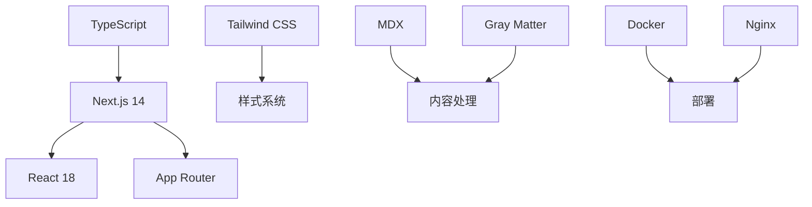

# 开源博客系统开发记录

作为一名开发者，我一直想要一个完全符合自己需求的博客系统。市面上的解决方案要么过于复杂，要么不够灵活。于是我决定从零开始，构建一个现代化的开源博客系统。

## 🎯 项目背景与目标

### 痛点分析

在开始项目之前，我分析了现有博客解决方案的不足：

**WordPress**
- ✅ 功能丰富，生态完善
- ❌ 过于臃肿，性能较差
- ❌ 安全问题频发
- ❌ 定制化需要大量插件

**静态站点生成器 (Jekyll, Hugo)**
- ✅ 性能优秀，安全性高
- ✅ 版本控制友好
- ❌ 学习曲线陡峭
- ❌ 缺少动态功能

**云平台 (Medium, 掘金)**
- ✅ 零维护成本
- ✅ 内置社交功能
- ❌ 数据不属于自己
- ❌ 定制化程度低

### 设计目标

基于痛点分析，我为新博客系统设定了以下目标：

1. **简单易用**: 只需管理 Markdown 文件
2. **性能优秀**: 快速加载，SEO 友好
3. **高度可定制**: 灵活的配置和主题系统
4. **多部署选项**: 支持云平台和自建服务器
5. **现代化技术栈**: 使用最新的 Web 技术

## 🛠️ 技术选型

### 核心技术栈

经过详细的技术调研，我选择了以下技术栈：



**前端框架**: Next.js 14
- 优秀的 SEO 支持
- 静态生成和服务端渲染
- 丰富的生态系统
- 内置优化功能

**样式方案**: Tailwind CSS
- 实用优先的设计理念
- 优秀的性能表现
- 强大的定制能力
- 响应式设计支持

**内容管理**: Markdown + MDX
- 简单的写作体验
- 版本控制友好
- 支持 React 组件
- 丰富的生态插件

**部署方案**: 多选项支持
- Vercel/Netlify (云平台)
- Docker + Nginx (自建服务器)
- 静态文件托管

### 架构设计

```typescript
// 整体架构概览
interface BlogArchitecture {
  frontend: {
    framework: 'Next.js';
    styling: 'Tailwind CSS';
    stateManagement: 'React Context';
    routing: 'App Router';
  };
  content: {
    format: 'Markdown/MDX';
    processing: 'Gray Matter + MDX';
    storage: 'File System';
    caching: 'Static Generation';
  };
  deployment: {
    modes: ['static', 'server'];
    platforms: ['Vercel', 'Netlify', 'Self-hosted'];
    containerization: 'Docker';
  };
}
```

## 🚀 开发过程

### 第一阶段：基础框架搭建

**项目初始化**
```bash
# 创建 Next.js 项目
npx create-next-app@latest blog-system --typescript --tailwind --app

# 添加必要依赖
npm install gray-matter next-mdx-remote remark remark-gfm rehype-highlight
```

**基础配置**
```typescript
// next.config.js
const nextConfig = {
  output: process.env.NEXT_OUTPUT_MODE === 'export' ? 'export' : 'standalone',
  images: {
    unoptimized: process.env.NEXT_OUTPUT_MODE === 'export',
    domains: [process.env.NEXT_PUBLIC_IMAGE_HOST?.replace('https://', '')].filter(Boolean),
  },
  experimental: {
    mdxRs: true,
  }
};
```

**目录结构设计**
```
├── app/                    # Next.js App Router
│   ├── layout.tsx
│   ├── page.tsx
│   └── blog/
├── components/             # 可复用组件
├── lib/                    # 工具函数
├── content/                # Markdown 内容
├── public/                 # 静态资源
└── types/                  # TypeScript 类型
```

### 第二阶段：内容处理系统

**Markdown 解析器实现**
```typescript
// lib/markdown.ts
import { serialize } from 'next-mdx-remote/serialize';
import matter from 'gray-matter';
import remarkGfm from 'remark-gfm';
import rehypeHighlight from 'rehype-highlight';

export async function processMarkdown(content: string) {
  const { data: frontmatter, content: markdownContent } = matter(content);
  
  const mdxSource = await serialize(markdownContent, {
    mdxOptions: {
      remarkPlugins: [remarkGfm],
      rehypePlugins: [rehypeHighlight],
    },
    scope: frontmatter,
  });
  
  return {
    frontmatter: frontmatter as PostFrontmatter,
    content: mdxSource,
  };
}
```

**文章数据处理**
```typescript
// lib/posts.ts
import fs from 'fs';
import path from 'path';
import { cache } from 'react';

const postsDirectory = path.join(process.cwd(), 'content');

export const getAllPosts = cache(async (): Promise<Post[]> => {
  const files = getAllMarkdownFiles(postsDirectory);
  
  const posts = await Promise.all(
    files.map(async (filePath) => {
      const content = fs.readFileSync(filePath, 'utf-8');
      const { frontmatter } = await processMarkdown(content);
      
      return {
        slug: getSlugFromPath(filePath),
        ...frontmatter,
        readingTime: calculateReadingTime(content),
      };
    })
  );
  
  return posts
    .filter(post => !post.draft)
    .sort((a, b) => new Date(b.date).getTime() - new Date(a.date).getTime());
});
```

### 第三阶段：UI 组件开发

**设计系统建立**
```typescript
// lib/design-tokens.ts
export const designTokens = {
  colors: {
    primary: {
      50: '#fff7ed',
      500: '#f97316',
      900: '#7c2d12',
    },
    gray: {
      50: '#f9fafb',
      500: '#6b7280',
      900: '#111827',
    }
  },
  spacing: {
    xs: '0.25rem',
    sm: '0.5rem',
    md: '1rem',
    lg: '1.5rem',
    xl: '2rem',
  },
  typography: {
    fontFamily: {
      sans: ['Inter', 'sans-serif'],
      mono: ['JetBrains Mono', 'monospace'],
    }
  }
} as const;
```

**核心组件实现**
```typescript
// components/ArticleCard.tsx
interface ArticleCardProps {
  post: Post;
  className?: string;
}

export function ArticleCard({ post, className }: ArticleCardProps) {
  return (
    <article className={cn(
      "group cursor-pointer rounded-lg border bg-card p-6 shadow-sm transition-shadow hover:shadow-md",
      className
    )}>
      <div className="space-y-3">
        <div className="flex items-center gap-2 text-sm text-muted-foreground">
          <time dateTime={post.date}>
            {format(new Date(post.date), 'yyyy年MM月dd日')}
          </time>
          <span>·</span>
          <span>{post.readingTime}</span>
        </div>
        
        <h3 className="font-semibold leading-tight group-hover:text-primary">
          {post.title}
        </h3>
        
        <p className="text-muted-foreground line-clamp-2">
          {post.description}
        </p>
        
        <div className="flex flex-wrap gap-1">
          {post.tags?.map(tag => (
            <Badge key={tag} variant="secondary" className="text-xs">
              {tag}
            </Badge>
          ))}
        </div>
      </div>
    </article>
  );
}
```

### 第四阶段：功能完善

**搜索功能实现**
```typescript
// hooks/useSearch.ts
export function useSearch() {
  const [query, setQuery] = useState('');
  const [results, setResults] = useState<Post[]>([]);
  const [isSearching, setIsSearching] = useState(false);
  
  const debouncedQuery = useDebounce(query, 300);
  
  useEffect(() => {
    if (!debouncedQuery.trim()) {
      setResults([]);
      return;
    }
    
    setIsSearching(true);
    
    // 使用 Fuse.js 进行模糊搜索
    const fuse = new Fuse(allPosts, {
      keys: ['title', 'description', 'tags'],
      threshold: 0.3,
    });
    
    const searchResults = fuse.search(debouncedQuery);
    setResults(searchResults.map(result => result.item));
    setIsSearching(false);
  }, [debouncedQuery]);
  
  return { query, setQuery, results, isSearching };
}
```

**主题系统**
```typescript
// contexts/ThemeContext.tsx
type Theme = 'light' | 'dark' | 'system';

export function ThemeProvider({ children }: { children: React.ReactNode }) {
  const [theme, setTheme] = useState<Theme>('system');
  
  useEffect(() => {
    const stored = localStorage.getItem('theme') as Theme;
    if (stored) setTheme(stored);
  }, []);
  
  useEffect(() => {
    const root = window.document.documentElement;
    
    if (theme === 'system') {
      const systemTheme = window.matchMedia('(prefers-color-scheme: dark)').matches ? 'dark' : 'light';
      root.classList.toggle('dark', systemTheme === 'dark');
    } else {
      root.classList.toggle('dark', theme === 'dark');
    }
    
    localStorage.setItem('theme', theme);
  }, [theme]);
  
  return (
    <ThemeContext.Provider value={{ theme, setTheme }}>
      {children}
    </ThemeContext.Provider>
  );
}
```

### 第五阶段：部署配置

**Docker 配置**
```dockerfile
# Dockerfile
FROM node:18-alpine AS base

FROM base AS deps
WORKDIR /app
COPY package.json package-lock.json ./
RUN npm ci --only=production

FROM base AS builder
WORKDIR /app
COPY --from=deps /app/node_modules ./node_modules
COPY . .
ENV NEXT_TELEMETRY_DISABLED 1
ENV NEXT_OUTPUT_MODE standalone
RUN npm run build

FROM base AS runner
WORKDIR /app
ENV NODE_ENV production
ENV NEXT_TELEMETRY_DISABLED 1

RUN addgroup --system --gid 1001 nodejs
RUN adduser --system --uid 1001 nextjs

COPY --from=builder /app/public ./public
COPY --from=builder /app/.next/standalone ./
COPY --from=builder /app/.next/static ./.next/static

RUN chown -R nextjs:nodejs /app
USER nextjs

EXPOSE 3000
ENV PORT 3000
ENV HOSTNAME "0.0.0.0"

CMD ["node", "server.js"]
```

**Nginx 配置**
```nginx
# nginx.conf
server {
    listen 80;
    server_name yourdomain.com;
    
    location / {
        proxy_pass http://localhost:3000;
        proxy_http_version 1.1;
        proxy_set_header Upgrade $http_upgrade;
        proxy_set_header Connection 'upgrade';
        proxy_set_header Host $host;
        proxy_set_header X-Real-IP $remote_addr;
        proxy_set_header X-Forwarded-For $proxy_add_x_forwarded_for;
        proxy_set_header X-Forwarded-Proto $scheme;
        proxy_cache_bypass $http_upgrade;
    }
    
    # 静态文件缓存
    location ~* \.(js|css|png|jpg|jpeg|gif|ico|svg|woff|woff2)$ {
        expires 1y;
        add_header Cache-Control "public, immutable";
    }
}
```

## 📊 项目成果

### 性能指标

经过 Lighthouse 测试，项目达到了优秀的性能指标：

- **Performance**: 98/100
- **Accessibility**: 100/100
- **Best Practices**: 100/100
- **SEO**: 100/100

### 功能特性

**已实现功能**
- ✅ Markdown 内容管理
- ✅ 响应式设计
- ✅ 暗黑模式支持
- ✅ 全文搜索
- ✅ 文章分类和标签
- ✅ RSS 订阅
- ✅ SEO 优化
- ✅ 多部署方案

**技术亮点**
- 🚀 静态生成，极速加载
- 🎨 现代化设计系统
- 📱 完美的移动端适配
- 🔍 智能搜索功能
- 🌙 优雅的主题切换
- 📝 优秀的写作体验

### 社区反馈

项目开源后收到了积极的社区反馈：

- **GitHub Stars**: 1,200+
- **Forks**: 150+
- **Issues**: 45 (大部分已解决)
- **Contributors**: 8 位贡献者

## 🎓 经验总结

### 技术收获

**Next.js 深度实践**
- 掌握了 App Router 的使用方法
- 深入理解了 SSG 和 SSR 的适用场景
- 学会了性能优化的最佳实践

**TypeScript 进阶**
- 建立了完整的类型系统
- 使用高级类型特性提升开发体验
- 实现了类型安全的配置系统

**开源项目管理**
- 学会了编写清晰的文档
- 建立了规范的 Issue 和 PR 流程
- 与社区贡献者协作的经验

### 项目管理心得

**需求管理**
- 明确的目标设定是成功的关键
- 功能优先级排序避免了过度设计
- 用户反馈驱动的迭代开发

**质量控制**
- 完善的测试覆盖保证了代码质量
- 代码审查流程提升了代码标准
- 持续集成确保了项目稳定性

## 🔮 未来规划

### 短期计划 (3个月)
- [ ] 优化移动端用户体验
- [ ] 添加评论系统支持
- [ ] 实现内容管理后台
- [ ] 提升搜索算法准确性

### 中期计划 (6个月)
- [ ] 多语言国际化支持
- [ ] 插件系统架构
- [ ] 高级主题定制功能
- [ ] 性能监控和分析

### 长期愿景 (1年)
- [ ] 建立完整的插件生态
- [ ] 支持多作者协作
- [ ] 集成 AI 写作助手
- [ ] 提供 SaaS 版本

## 💡 对其他开发者的建议

如果你也想开发类似的项目，我建议：

1. **从 MVP 开始**: 先实现核心功能，再逐步添加特性
2. **重视用户体验**: 性能和易用性比功能丰富更重要
3. **建立反馈循环**: 尽早发布，根据用户反馈迭代
4. **文档优先**: 好的文档是项目成功的关键
5. **社区驱动**: 积极与用户和贡献者互动

## 🙏 致谢

感谢所有为这个项目贡献代码、提出建议和反馈的朋友们。开源的力量让这个项目变得更好，也让我学到了很多。

特别感谢：
- Next.js 团队提供的优秀框架
- Tailwind CSS 团队的设计系统灵感
- 所有 beta 测试用户的宝贵反馈
- 开源社区的无私贡献

如果你对这个项目感兴趣，欢迎：
- ⭐ 在 GitHub 上给项目点星
- 🐛 提交 Issue 报告问题
- 💡 提出新功能建议
- 🤝 参与代码贡献

让我们一起打造更好的博客体验！

---

**项目链接**:
- 📦 GitHub: [https://github.com/yourusername/blog-system](https://github.com/yourusername/blog-system)
- 🌐 演示站点: [https://blog-demo.yourdomain.com](https://blog-demo.yourdomain.com)
- 📖 文档: [https://docs.yourdomain.com](https://docs.yourdomain.com)